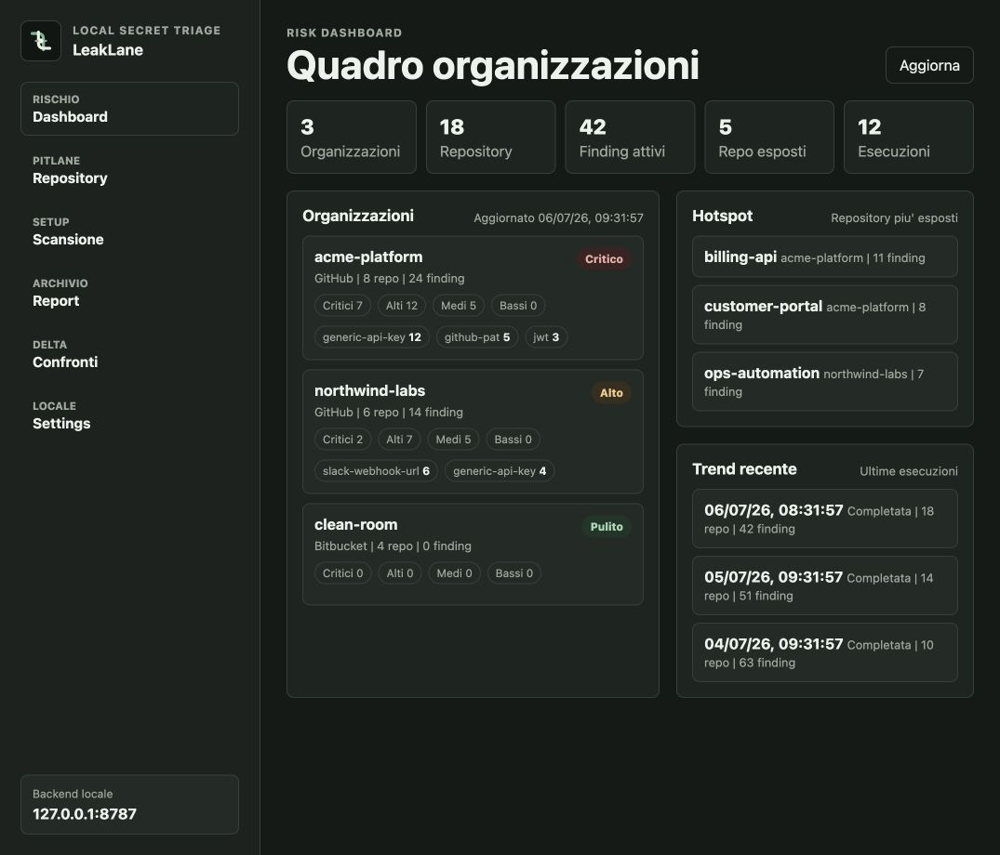
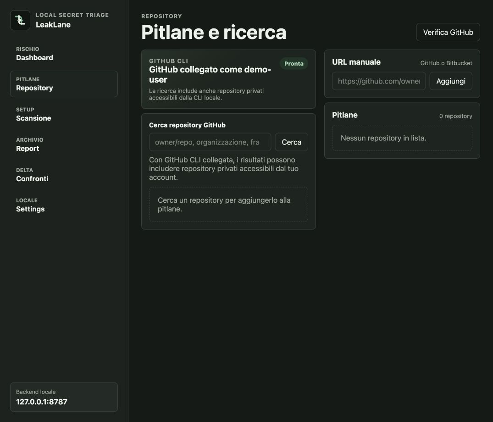
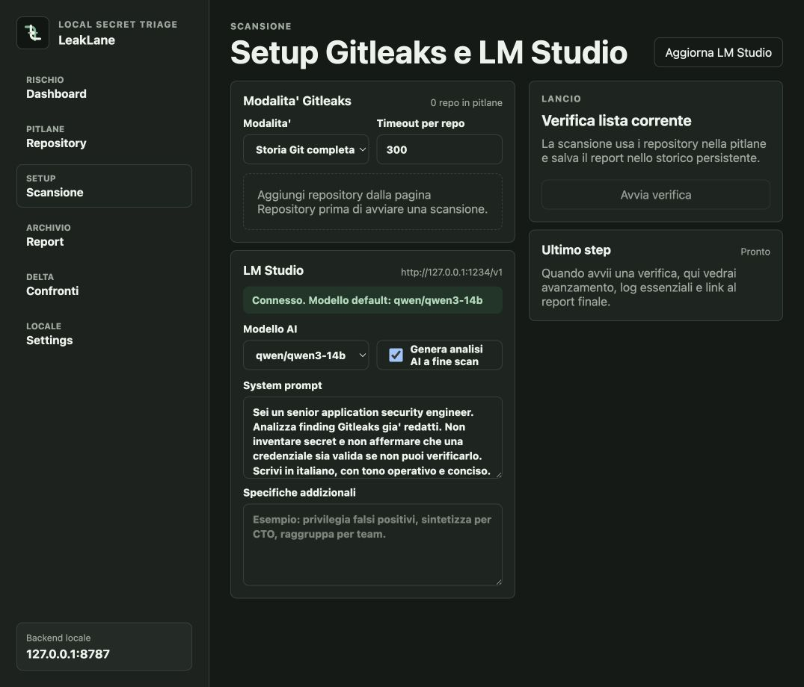
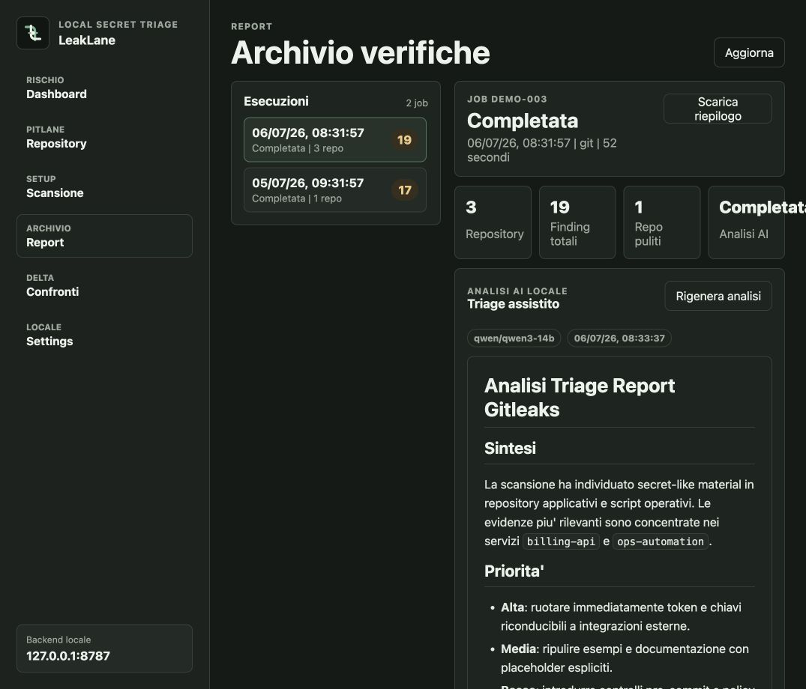

# LeakLane

<p align="center">
  
</p>

<p align="center">
  <strong>Local secret triage for repository fleets.</strong>
</p>

<p align="center">
  Scan public and private repositories with Gitleaks, preserve every report, and generate local AI triage through LM Studio.
</p>

<p align="center">
  <a href="https://github.com/stefanodenti/leaklane/releases/tag/v0.2.0-alpha.1"></a>
  
  
  
</p>

LeakLane is a local-first desktop and web console for teams that need repeatable secret scanning without sending repository data, findings, or AI prompts to a hosted service.

It helps you build a repository pitlane, run Gitleaks in a controlled way, keep a historical archive of executions, compare deltas, and turn raw findings into a readable security triage.



## Why LeakLane

- **Fleet scanning, not one-off scans**: collect GitHub and Bitbucket repositories into a reusable pitlane.
- **Private GitHub repositories**: use the local GitHub CLI session without storing GitHub tokens in LeakLane.
- **Persistent evidence**: keep executions, findings, raw JSON reports, generated AI analysis, and deltas.
- **Repository intelligence**: inspect branches, tags, recent commits, PRs, and leak overlays in one map.
- **Interactive graph controls**: zoom, drag, filter branch/tag/PR/finding overlays, and drill into findings.
- **Local AI review**: ask LM Studio to summarize risk, likely false positives, and remediation priorities.
- **Desktop ready**: run the SvelteKit UI as a Tauri app with a local Python backend.

## Screenshots

Screenshots use demo data.



| Configure scans | Review reports |
| --- | --- |
|  |  |

## What It Does

- Search GitHub repositories and build a scan pitlane.
- Add GitHub or Bitbucket repository URLs manually.
- Use GitHub CLI authentication for private GitHub repositories.
- Run Gitleaks in `git` or `dir` mode.
- Persist every execution, finding, JSON report, and AI analysis.
- Compare scan deltas across repeated executions.
- Inspect repository structure through a Git graph-style map.
- Generate local Markdown triage with LM Studio.
- Run as a SvelteKit web UI or a Tauri desktop app.

## Requirements

- Git
- Gitleaks
- Python 3.10+
- Node.js and npm
- Rust/Cargo for desktop builds
- GitHub CLI, optional but recommended for private GitHub repositories
- LM Studio, optional for local AI analysis

On macOS:

```bash
brew install gitleaks rust
```

GitHub CLI authentication:

```bash
gh auth login -h github.com
```

LeakLane does not store GitHub tokens. It uses the local session managed by `gh`.

## Quick Start

Start the backend from the project root:

```bash
python3 web_app.py 8787
```

Start the SvelteKit UI:

```bash
cd desktop-ui
npm install
npm run dev -- --port 5174
```

Open:

```txt
http://127.0.0.1:5174/
```

## Desktop App

The Tauri launcher starts the Python backend automatically if `127.0.0.1:8787` is not already responding.

```bash
cd desktop-ui
npm run tauri:dev
```

Build a local desktop package:

```bash
npm run tauri:build
```

The latest alpha release includes a macOS Apple Silicon DMG:

[Download LeakLane v0.2.0-alpha.1](https://github.com/stefanodenti/leaklane/releases/tag/v0.2.0-alpha.1)

## Local AI Triage

LeakLane can call an OpenAI-compatible LM Studio server after a scan and save the generated Markdown analysis with the report.

Default local endpoint:

```txt
http://127.0.0.1:1234/v1
```

You can choose the model, edit the system prompt, and add extra instructions before launching the scan.

## Report Storage

In web development, reports are written to:

```txt
gitleaks-web-reports/
```

In desktop production, reports are written to the app data directory.

## Build Checks

```bash
python3 -m py_compile web_app.py scan_public_repos.py
cd desktop-ui
npm run check
npm run build
cd src-tauri
cargo check
```

## Brand

LeakLane's mark represents two repository lanes crossing through a protected center point: source history enters, findings are surfaced, and the operator decides what moves forward.

See `BRAND.md` for the lightweight brand notes.

## Release Status

`v0.2.0-alpha.1` is a minor alpha focused on Repository Intelligence: branch/tag/PR mapping, Git graph-style navigation, finding overlays, bottom drawer inspection, clickable graph nodes, and a collapsible workspace sidebar. It is useful for local validation and early feedback, but macOS builds are currently unsigned and not notarized.
